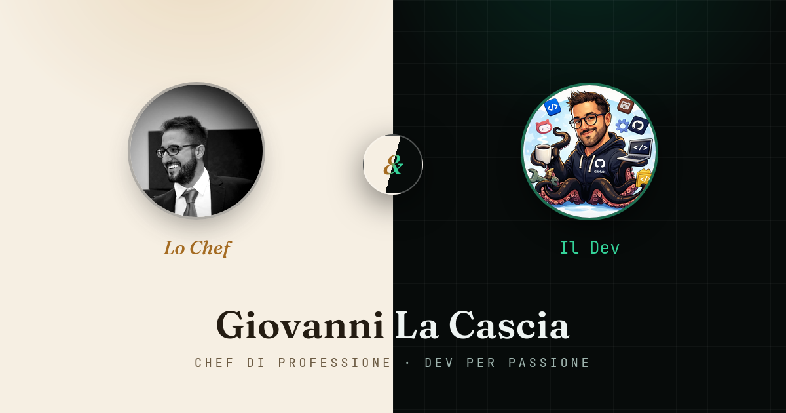

# 👨‍🍳💻 giosci1994.github.io

**Personal site of Giovanni La Cascia — Chef by day, Dev by night.**
A split-screen landing page that tells two stories: ten years of Italian fine
dining, and a homelab full of containers and home-automation projects.

**🇬🇧 English** · [🇮🇹 Italiano](#italiano)

<p align="center">
  <a href="https://giosci1994.github.io"></a>
  
  
  
  <a href="LICENSE"></a>
</p>

<p align="center">
  <a href="https://giosci1994.github.io">
    
  </a>
</p>

<p align="center"><strong>🌐 Live: <a href="https://giosci1994.github.io">giosci1994.github.io</a></strong></p>

---

## ✨ Highlights

- 🎭 **Two souls, two pages** — a split-screen chooser (`index.html`) leads to the
  **Chef** and the **Dev** side, each with its own theme.
- 🎨 **Dual theme** — warm paper/amber & serif for the kitchen, dark green/teal &
  mono for the code, from a single shared stylesheet.
- 🌍 **Bilingual IT/EN** — client-side language switch with no page reload; the
  choice is remembered in `localStorage`.
- ⚡ **Zero build step** — plain HTML + CSS + vanilla JS. Nothing to compile,
  nothing to install.
- 📱 **Responsive & accessible** — mobile-friendly layout, `prefers-reduced-motion`
  aware reveal animations, ARIA labels on interactive controls.
- 🔍 **SEO & social ready** — per-page `<title>`/description, Open Graph + Twitter
  cards, a 1200×630 social preview and an SVG favicon.

---

## 🧱 Tech stack

| | |
|---|---|
| **Markup** | HTML5 (semantic, one file per page) |
| **Styling** | CSS3 — custom properties, flex/grid, dual-theme, no framework |
| **Behaviour** | Vanilla JS (ES/IIFE) — i18n, lang switch, `IntersectionObserver` reveals |
| **Fonts** | Fraunces · Inter · JetBrains Mono (Google Fonts) |
| **Hosting** | GitHub Pages (deploy from `main` branch, root) |

---

## 🧩 Project structure

```
index.html          split-screen chooser: two souls, two pages
chef.html           the kitchen journey (warm paper/amber theme, serif)
dev.html            homelab & open-source projects (dark green/teal theme, mono)
style.css           shared dual-theme stylesheet
assets/
  i18n.js           IT/EN translations (data-i18n keys) + shared boot logic
  favicon.svg       site icon
  giovanni-chef.webp / giovanni-dev.webp   portraits
  social-preview.png / social-preview.html   Open Graph image (+ its source)
google*.html        Google Search Console verification file
```

---

## 🛠️ Run locally

No dependencies — it's a static site. Just serve the folder over HTTP so that
relative paths and `localStorage` behave like in production:

```bash
git clone https://github.com/giosci1994/giosci1994.github.io.git
cd giosci1994.github.io

# pick any static server:
python -m http.server 8000        # → http://localhost:8000
# or
npx serve .
```

Opening the files directly with `file://` mostly works too, but a local server
is closer to how GitHub Pages serves the site.

---

## 🚀 Deploy (GitHub Pages)

The site is served straight from the repository — no pipeline, no artifacts:

1. Repo → **Settings → Pages**
2. **Source**: *Deploy from a branch*
3. **Branch**: `main` · **Folder**: `/ (root)`

Every push to `main` is published to **https://giosci1994.github.io** within a
minute or two.

---

## 🌍 Internationalization (i18n)

All copy lives in one place: [`assets/i18n.js`](assets/i18n.js). Each translatable
element carries a `data-i18n="some.key"` attribute, and the script swaps the text
for the chosen language:

```html
<h2 data-i18n="chef.s.title">Dieci anni tra i fornelli</h2>
```

The boot logic also localizes each page's `<title>` and meta description, toggles
the IT/EN buttons, persists the choice, and (for a couple of rich-text keys)
injects HTML safely from an allow-list. **To add a language**, add a new
dictionary next to `it` / `en` and a matching button — no other file changes.

---

## 📄 License

The **source code** (HTML/CSS/JS) is released under the [GNU GPLv3 License](LICENSE) —
feel free to reuse the structure and the i18n approach.

> ℹ️ **Not covered by GPLv3:** the personal photographs (`giovanni-*.webp`), the
> biographical/career content and the personal branding are © Giovanni La Cascia,
> all rights reserved. Please don't reuse those as your own.

<br>

---
---

<a id="italiano"></a>

# 🇮🇹 Italiano

**Pagina personale di Giovanni La Cascia — Chef di giorno, Dev di notte.**
Una landing split-screen che racconta due storie: dieci anni di fine dining
italiano e un homelab pieno di container e progetti di domotica.

<p align="center"><strong>🌐 Online: <a href="https://giosci1994.github.io">giosci1994.github.io</a></strong></p>

## ✨ In breve

- 🎭 **Due anime, due pagine** — un chooser split-screen (`index.html`) porta al
  lato **Chef** e al lato **Dev**, ognuno con il suo tema.
- 🎨 **Doppio tema** — carta/ambra caldo e serif per la cucina, verde/teal scuro e
  mono per il codice, da un unico foglio di stile condiviso.
- 🌍 **Bilingue IT/EN** — switch di lingua lato client senza ricaricare la pagina;
  la scelta è ricordata in `localStorage`.
- ⚡ **Zero build step** — solo HTML + CSS + JS vanilla. Niente da compilare,
  niente da installare.
- 📱 **Responsive e accessibile** — layout mobile-friendly, animazioni che
  rispettano `prefers-reduced-motion`, label ARIA sui controlli.
- 🔍 **Pronto per SEO e social** — `<title>`/description per pagina, Open Graph +
  Twitter card, immagine social 1200×630 e favicon SVG.

## 🧱 Stack

- **HTML5** semantico (un file per pagina)
- **CSS3** con custom properties, flex/grid, doppio tema, nessun framework
- **JS vanilla** (IIFE) — i18n, switch lingua, reveal con `IntersectionObserver`
- **Font**: Fraunces · Inter · JetBrains Mono (Google Fonts)
- **Hosting**: GitHub Pages (deploy dal branch `main`, root)

## 🧩 Struttura

- `index.html` — chooser split-screen: due anime, due pagine
- `chef.html` — il percorso in cucina (tema caldo carta/ambra, serif)
- `dev.html` — homelab e progetti open source (tema scuro verde/teal, mono)
- `style.css` — dual-theme condiviso
- `assets/i18n.js` — traduzioni IT/EN (chiavi `data-i18n`) + boot comune

## 🛠️ Avvio in locale

È un sito statico, nessuna dipendenza. Basta servirlo via HTTP:

```bash
git clone https://github.com/giosci1994/giosci1994.github.io.git
cd giosci1994.github.io
python -m http.server 8000        # → http://localhost:8000
```

## 🚀 Deploy (GitHub Pages)

Servito direttamente dal repository, senza pipeline:

1. Repo → **Settings → Pages**
2. **Source**: *Deploy from a branch*
3. **Branch**: `main` · **Cartella**: `/ (root)`

Ogni push su `main` viene pubblicato su **https://giosci1994.github.io** in un
paio di minuti.

## 🌍 Internazionalizzazione (i18n)

Tutti i testi stanno in [`assets/i18n.js`](assets/i18n.js). Ogni elemento
traducibile ha un attributo `data-i18n="chiave"` e lo script sostituisce il testo
in base alla lingua scelta, localizzando anche `<title>` e meta description. Per
**aggiungere una lingua** basta un nuovo dizionario accanto a `it` / `en` e un
pulsante corrispondente.

## 📄 Licenza

Il **codice sorgente** (HTML/CSS/JS) è rilasciato con [licenza GNU GPLv3](LICENSE).

> ℹ️ **Non coperti da GPLv3:** le foto personali (`giovanni-*.webp`), i contenuti
> biografici e il personal branding sono © Giovanni La Cascia, tutti i diritti
> riservati.

---

<p align="center"><sub>fatto con ❤️ tra fornelli e container · made with ❤️ between stoves and containers</sub></p>
